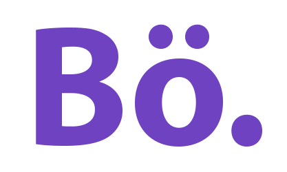

[![Contributors][contributors-shield]][contributors-url]
[![Forks][forks-shield]][forks-url]
[![Stargazers][stars-shield]][stars-url]
[![Issues][issues-shield]][issues-url]
[![MIT License][license-shield]][license-url]
[![LinkedIn][linkedin-shield]][linkedin-url]

 

  

  <h3 align="center">Batuhan Özkan Landing Page</h3>

  

    Landing page.
     
    </a>
     
     
    <a href="https://batuhanozkan.dev" target="_blank">Site</a>
    ·
    <a href="https://github.com/bozkankod/landing-page/issues">Bug Raporla</a>
    ·
    <a href="https://github.com/bozkankod/landing-page/issues">Yeni Özellik İste</a>
  

## Proje Hakkında
Kendimi tanıtmak ve kişisel bir web sayfamın olması amacıyla oluşturulan app.

(<a href="#readme-top">Yukarı Git</a>)

### Ne Kullandım?

 

* [![React][React.js]][React-url]
* 
* 

(<a href="#readme-top">Yukarı Git</a>)

## Katkıda Bulunmak

Katkılar, açık kaynak topluluğunu öğrenmek, ilham almak ve yaratmak için muhteşem bir yer haline getiren unsurlardır. Yaptığınız herhangi bir katkı **çok değerlidir**.

Bu projeyi daha iyi hale getirecek bir öneriniz varsa, lütfen depoyu forklayın ve bir pull isteği oluşturun. Ayrıca, "geliştirme" etiketiyle basitçe bir sorun (issue) açabilirsiniz.
Projeye yıldız vermeyi unutmayın! Tekrar teşekkürler!

1. Projeyi forkla
2. Yeni özellik için branch oluştur (`git checkout -b ozellik/InanilmazOzellik`)
3. Değişiklikleri commitle (`git commit -m 'InanilmazOzellik'`)
4. Branchı pushla (`git push origin ozellik/InanilmazOzellik`)
5. PR aç

(<a href="#readme-top">Yukarı Git</a>)

## Lisans

MIT Lisansı altında saklanır detaylar için `LICENSE.md` okuyabilirsiniz.

(<a href="#readme-top">Yukarı Git</a>)

## İletişim

Batuhan Özkan - [@batujsx](https://twitter.com/batujsx) - bozkankod@gmail.com - 
[Linkedin](https://www.linkedin.com/in/batudev/)

Proje: [https://github.com/bozkankod/landing-page](https://github.com/bozkankod/landing-page)

(<a href="#readme-top">Yukarı Git</a>)

[linkedin-url]: https://www.linkedin.com/in/landing-page/
[contributors-shield]: https://img.shields.io/github/contributors/bozkankod/landing-page.svg?style=for-the-badge
[contributors-url]: https://github.com/Bozkankod/landing-page/graphs/contributors/
[forks-shield]: https://img.shields.io/github/forks/bozkankod/landing-page.svg?style=for-the-badge
[forks-url]: https://github.com/bozkankod/landing-page/network/members
[stars-shield]: https://img.shields.io/github/stars/bozkankod/landing-page.svg?style=for-the-badge
[stars-url]: https://github.com/bozkankod/landing-page/stargazers
[issues-shield]: https://img.shields.io/github/issues/bozkankod/landing-page.svg?style=for-the-badge
[issues-url]: https://github.com/bozkankod/landing-page/issues
[license-shield]: https://img.shields.io/github/license/bozkankod/landing-page.svg?style=for-the-badge
[license-url]: https://github.com/bozkankod/landing-page/blob/main/LICENSE.MD
[linkedin-shield]: https://img.shields.io/badge/-LinkedIn-black.svg?style=for-the-badge&logo=linkedin&colorB=555
[linkedin-url]: https://linkedin.com/company/scrum-point
[product-screenshot]: images/screenshot.png
[Next.js]: https://img.shields.io/badge/next.js-000000?style=for-the-badge&logo=nextdotjs&logoColor=white
[Next-url]: https://nextjs.org/
[React.js]: https://img.shields.io/badge/React-20232A?style=for-the-badge&logo=react&logoColor=61DAFB
[React-url]: https://reactjs.org/
[Vue.js]: https://img.shields.io/badge/Vue.js-35495E?style=for-the-badge&logo=vuedotjs&logoColor=4FC08D
[Vue-url]: https://vuejs.org/
[Angular.io]: https://img.shields.io/badge/Angular-DD0031?style=for-the-badge&logo=angular&logoColor=white
[Angular-url]: https://angular.io/
[Svelte.dev]: https://img.shields.io/badge/Svelte-4A4A55?style=for-the-badge&logo=svelte&logoColor=FF3E00
[Svelte-url]: https://svelte.dev/
[Laravel.com]: https://img.shields.io/badge/Laravel-FF2D20?style=for-the-badge&logo=laravel&logoColor=white
[Laravel-url]: https://laravel.com
[Bootstrap.com]: https://img.shields.io/badge/Bootstrap-563D7C?style=for-the-badge&logo=bootstrap&logoColor=white
[Bootstrap-url]: https://getbootstrap.com
[JQuery.com]: https://img.shields.io/badge/jQuery-0769AD?style=for-the-badge&logo=jquery&logoColor=white
[JQuery-url]: https://jquery.com 
